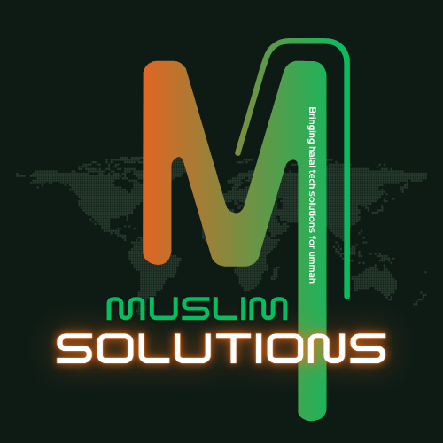

<h1>Muslim Solutions</h1>

<b>International-grade halal software company. Reliable platforms for work & worship, plus custom websites & apps built on amanah.</b>

🕌 Who We Are

Muslim Solutions — Bringing Halal Tech Solutions for Ummah

We are an international-grade software company based in Bangladesh. Our mission is simple:

    Our own halal platforms, and websites, web apps, and software for a person or an organization — for the good of this world and the Hereafter.

We build two things:

1. Our Own Halal Platforms (Growing Ecosystem)
We are building a suite of platforms for everyday Muslim life — from finance to family. Our own platforms have core features free, advanced tools by subscription. Current focus areas include Islamic finance management, anonymous safe sharing, child tarbiyah, parenting, and scholar consultations.

More products are coming — this is just the beginning.

2. Custom Solutions
For individuals and organizations — any website, web app, or software — from understanding your need through design to launch. Built with halal principles and data as trust (amanah).
🛡️ How We Build — Our Principles
Principle	What It Means
100% Halal Technology	Every feature checked with Shariah guidance. No riba logic, no haram content, no privacy violation.
International Standards	Clean architecture, SOLID, modern tech stack, world-class development.
User Privacy First	Data is amanah. Never sold or misused. Local AI preferred over cloud AI.
Platforms + Custom	Free core + subscription for own platforms, and custom builds for clients at fair price.
🛠️ Our Tech Stack

AI Engineering:
LLM
Python
TypeScript
OpenAI
LangChain
Vector DB

Full-Stack — MERN & Beyond:
MongoDB
Express.js
React.js
Node.js
Next.js
Docker
AWS

Methodologies: Clean Architecture • System Design • Security by Default • Documentation First
🔒 Current Status

    Our main work repositories are currently private — we are in pre-launch & hiring phase. Public launches coming soon. This profile is our public presence.

We are actively building:

    muslim-solutions-website — our official website (Next.js + TypeScript)
    Upcoming platforms with TypeScript, Python (FastAPI + LLM), MongoDB, RAG, Vector DB
    Security hardening, 2FA, branch protection, GitLab backup mirror

🤝 Work With Us
Purpose	Contact
Custom website / web app / software	muslimsolutions.software/contact
Partnership / Investment	info@muslimsolutions.software
Join Our Team	+8801841633295
Blog & Thoughts	muslimsolutions.software/blog

 
🇧🇩 Bangladesh | International-grade halal software company | Building Halal Tech Solutions for Ummah 
© 2026 Muslim Solutions — More products coming

